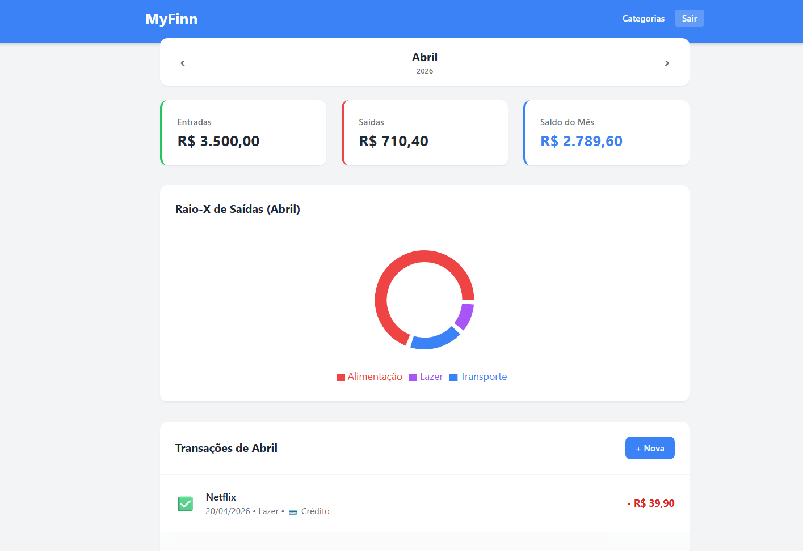

# 💸 MyFinn - Gestor Financeiro Pessoal



O **MyFinn** é uma aplicação Full-Stack de gestão financeira pessoal desenhada para ser rápida, visual e inteligente. Chega de planilhas complexas: controle os seus gastos com gráficos interativos, automação de despesas fixas e gestão de parcelas de cartão de crédito.

## ✨ Funcionalidades Principais
* **Dashboard Interativo:** Resumo de Entradas, Saídas e Saldo do Mês com navegação temporal.
* **Raio-X de Despesas (Gráfico Donut):** Entenda para onde vai o seu dinheiro com um gráfico gerado dinamicamente (Recharts).
* **Automação de Assinaturas (Robô):** Despesas fixas (como Netflix ou Renda) transitam automaticamente para os meses seguintes.
* **Gestão de Cartão de Crédito:** Lançamentos parcelados são divididos inteligentemente ao longo dos meses correspondentes.
* **Reconciliação Bancária:** Alternância rápida entre transações "Pagas" (✅) e "Pendentes" (⏳).

## 🛠️ Tecnologias Utilizadas
**Frontend:**
* React.js (Vite)
* Tailwind CSS (Estilização)
* Recharts (Gráficos)
* Axios (Consumo de API)

**Backend:**
* Java 17 + Spring Boot 3
* Spring Security + JWT (Autenticação)
* Spring Data JPA (Hibernate)
* PostgreSQL / Banco de Dados Relacional

## 🚀 Como testar a aplicação (Dados de Demonstração)
A API possui um `DataSeeder` embutido. Ao rodar o Backend com o banco de dados limpo, o sistema gera automaticamente um histórico financeiro inteligente baseado no mês atual para facilitar a avaliação do projeto.

**Credenciais de Acesso (Demo):**
* **Email:** `demo@myfinn.com`
* **Senha:** `123456`

## ⚙️ Como executar localmente

1. **Clone o repositório:**
   ```bash
   git clone (https://github.com/Pereira-gu/MyFinn)
